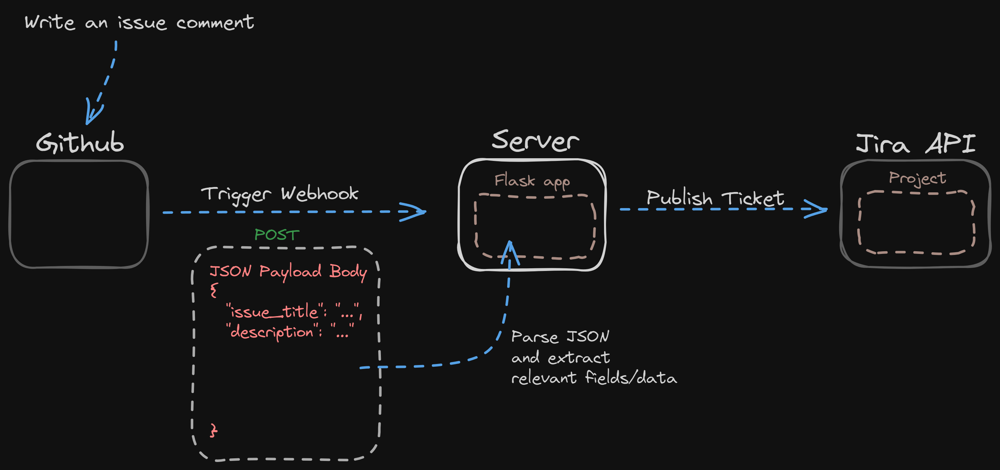
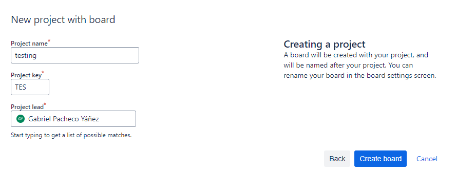
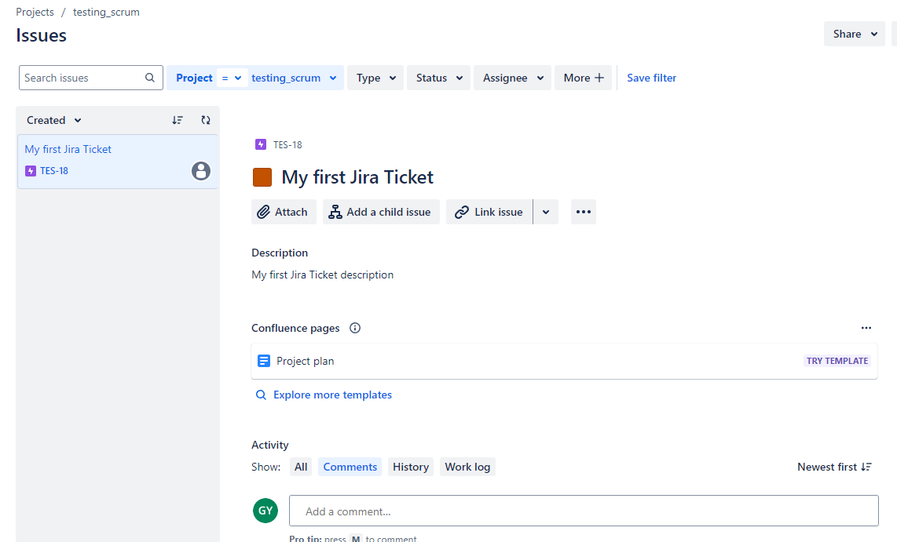
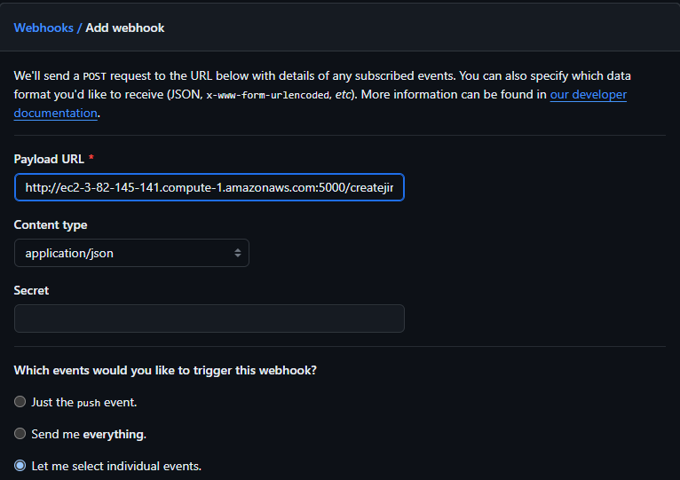
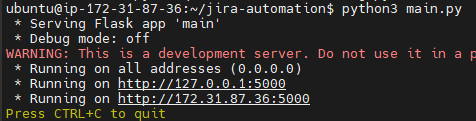
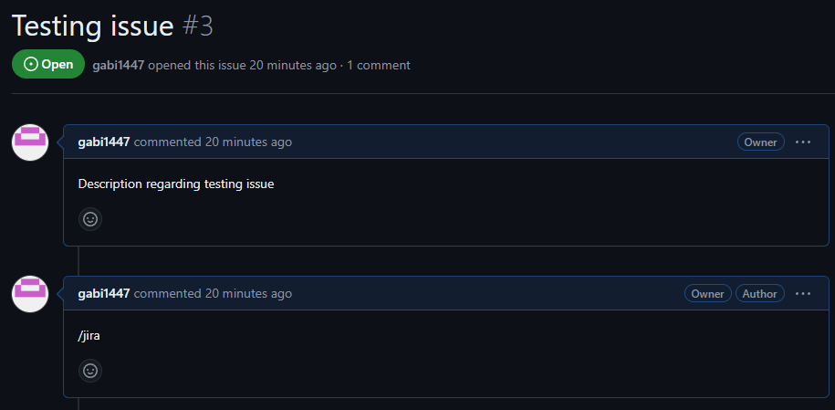
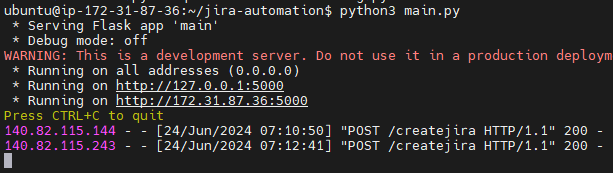
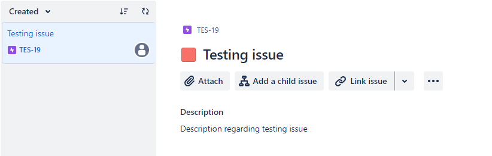

# Jira Ticket Automation with Github Webhook and Flask



## Overview of the Project

In this project we are going to cover how to automate Jira tickets from Github when an
`issue` in our repo is commented in the following way: "/jira". Whenever we type "/jira" in an `issue` we consider of relevant importance, this will trigger a `webhook` towards a `URL endpoint` where it will `POST` a payload with data about the issue and then this endpoint, which is declared in a `Flask application` will parse the payload, it will check that the body of the comment is equal to "/jira"(we don't want to create a jira ticket everytime we comment on an issue, only when "/jira" is commented), then it will extract the necessary data to include in the `jira ticket` and finally using the `requests` module inside Flask, we'll communicate with the `Jira API` to publish the ticket in our specified `Jira project`, for this of course we'll authenticate using an `API-TOKEN`.


## 1. **Create `Jira Project` and generate `API-TOKEN`.**

Once you've created your Jira account you can create a scrum project by going to the search bar and clicking on `boards --> create board`. We'll be prompted the following window, in which we will name our project, in the future we'll use the `project key` to specify to which project we want to publish our Jira ticket when communicating with the Jira API.



To generate the `API-TOKEN` we just have to go to `manage-account --> security --> create api token` in the Jira UI. We'll use this api token to authenticate with Jira when making the api request.

## 2. **Creating Jira ticket with the `requests` module in python.**

Before creating the API in `Flask` and the `Webhook` in Github, we'll test the creating of a Jira ticket/issue using the requests module and the Jira API documentation --> https://developer.atlassian.com/cloud/jira/platform/rest/v3/api-group-issues/#api-rest-api-3-issue-post.

**Example of Issue creation:**

```python
# This code sample uses the 'requests' library:
# http://docs.python-requests.org
import requests
from requests.auth import HTTPBasicAuth
import json

url = "https://your-domain.atlassian.net/rest/api/3/issue"

auth = HTTPBasicAuth("email@example.com", "<api_token>")

headers = {
  "Accept": "application/json",
  "Content-Type": "application/json"
}

payload = json.dumps( {
  "fields": {
    "assignee": {
      "id": "5b109f2e9729b51b54dc274d"
    },
    "components": [
      {
        "id": "10000"
      }
    ],
    "customfield_10000": "09/Jun/19",
    "customfield_20000": "06/Jul/19 3:25 PM",
    "customfield_30000": [
      "10000",
      "10002"
    ],
    "customfield_40000": {
      "content": [
        {
          "content": [
            {
              "text": "Occurs on all orders",
              "type": "text"
            }
          ],
          "type": "paragraph"
        }
      ],
      "type": "doc",
      "version": 1
    },
    "customfield_50000": {
      "content": [
        {
          "content": [
            {
              "text": "Could impact day-to-day work.",
              "type": "text"
            }
          ],
          "type": "paragraph"
        }
      ],
      "type": "doc",
      "version": 1
    },
    "customfield_60000": "jira-software-users",
    "customfield_70000": [
      "jira-administrators",
      "jira-software-users"
    ],
    "customfield_80000": {
      "value": "red"
    },
    "description": {
      "content": [
        {
          "content": [
            {
              "text": "Order entry fails when selecting supplier.",
              "type": "text"
            }
          ],
          "type": "paragraph"
        }
      ],
      "type": "doc",
      "version": 1
    },
    "duedate": "2019-05-11",
    "environment": {
      "content": [
        {
          "content": [
            {
              "text": "UAT",
              "type": "text"
            }
          ],
          "type": "paragraph"
        }
      ],
      "type": "doc",
      "version": 1
    },
    "fixVersions": [
      {
        "id": "10001"
      }
    ],
    "issuetype": {
      "id": "10000"
    },
    "labels": [
      "bugfix",
      "blitz_test"
    ],
    "parent": {
      "key": "PROJ-123"
    },
    "priority": {
      "id": "20000"
    },
    "project": {
      "id": "10000"
    },
    "reporter": {
      "id": "5b10a2844c20165700ede21g"
    },
    "security": {
      "id": "10000"
    },
    "summary": "Main order flow broken",
    "timetracking": {
      "originalEstimate": "10",
      "remainingEstimate": "5"
    },
    "versions": [
      {
        "id": "10000"
      }
    ]
  },
  "update": {}
} )

response = requests.request(
   "POST",
   url,
   data=payload,
   headers=headers,
   auth=auth
)

print(json.dumps(json.loads(response.text), sort_keys=True, indent=4, separators=(",", ": ")))
```

In this example we'll have to use the URL of our `atlassian` domain, the email with which we created our Jira account and the API-TOKEN we generated before. The payload is quite lengthy, but not all the fields shown in the example payload are required, so we are just gonna include the ones that are.

**Short example of issue creation:**

```python
import requests
from requests.auth import HTTPBasicAuth
import json

url = "https://your-domain.atlassian.net/rest/api/3/issue"

auth = HTTPBasicAuth("email@example.com", "<api_token>")

headers = {
    "Accept": "application/json",
    "Content-Type": "application/json"
}

payload = json.dumps( {
"fields": {
    "description": {
        "content": [
        {
        "content": [
            {
                "text": "My first Jira Ticket description",
                "type": "text"
            }
        ],
        "type": "paragraph"
        }
    ],
    "type": "doc",
    "version": 1
    },
    "issuetype": {
        "id": "10000"
    },
    "project": {
        "key": "TES"
    },
    "summary": "My first Jira Ticket",
    },
    "update": {}
} )

response = requests.request(
    "POST",
    url,
    data=payload,
    headers=headers,
    auth=auth
)

print(json.dumps(json.loads(response.text), sort_keys=True, indent=4, separators=(",", ": ")))
```

We'll specify the `title` of our ticket/issue inside the payload in `fields["description"]["content"][0]["content"][0]["text"]`, the description of the issue in `fields["summary"]`, the project key(which identifies the project the issue is being published in) in `fields["project"]["key"]` and the `issuetype`, this field means the type of issue we are going to publish, we can leave it with the default value.

When executing the script we should get an output like this:

```bash
$ python3 create_jira.py
{
    "id": "10020",
    "key": "TES-17",
    "self": "https://gabrielpachecoyanezit.atlassian.net/rest/api/3/issue/10020"
}
```

We can then check in the Jira UI if the ticket has been created:



## 3. **Creating `Flask API` and deploying it in AWS using an EC2 Instance.**

In this demo, we'll run our Flask API in an EC2 Instance, that will act as an intermidiary point between Github and Jira, capturing the JSON payload triggered by github, extracting data from it and generating the issue/ticket in our Jira project.

To achieve this we'll first launch an EC2 instance with a public ip address, a valid key-pair to connect via `SSH` and we'll create an `inbound rule` on the `security group` attached to the instance opening `port 5000` which is the port in which Flask runs by default. I'm not gonna go into too much detail regarding this, because it's very well documented already.

First thing we should do when launching our EC2 Instance is run `sudo apt update` and `sudo apt upgrade` to have everything up to date. Next we'll need to install the `flask` framework, we can install it by running `pip install flask` or `pip3 install flask`. I was having some trouble installing it using pip, so you can alternatively run `sudo apt install python3-flask`.

Once we have our dependencies installed, we can either clone the repo where our python flask code is stored or we can start writing it in the server.

**Python Flask API application:**

```python
from flask import Flask, request
import requests
from requests.auth import HTTPBasicAuth
import json
import os

app = Flask(__name__)

# Defining API endpoint and HTTP method
@app.route('/createjira', methods=['POST'])
def create_jira_ticket():
    # Obtaining sensitive information from environment variables
    url = os.getenv("URL")
    email = os.getenv("EMAIL")
    api_token = os.getenv("API_TOKEN")

# Checking if the POST request is JSON
    if request.is_json:
        data = request.get_json()
        # Extracting data from the Github JSON Issue 
        # that will then be appended to the Jira payload
        issue_comment = data.get('comment', {}).get('body')
        title = data.get('issue', {}).get('title')
        description = data.get('issue', {}).get('body')

    auth = HTTPBasicAuth(email, api_token)

    headers = {
        "Accept": "application/json",
        "Content-Type": "application/json"
    }

# JSON payload that will be sent to the Jira API
    payload = json.dumps( {
    "fields": {
        "description": {
            "content": [
            {
            "content": [
                {
                    "text": description,
                    "type": "text"
                }
            ],
            "type": "paragraph"
            }
        ],
        "type": "doc",
        "version": 1
        },
        "issuetype": {
            "id": "10000"
        },
        "project": {
            "key": "TES"
        },
        "summary": title,
        },
        "update": {}
    } )

# Publishing issue/ticket on Jira project if the 
# content of the issue comment is "/jira"
    if issue_comment == "/jira":
        response = requests.request(
            "POST",
            url,
            data=payload,
            headers=headers,
            auth=auth
        )

        return json.dumps(json.loads(response.text), sort_keys=True, indent=4, separators=(",", ": "))
    
    else:
        return "Error"

# Running the application on port 5000 and 
# allowing any IP Address to interact with the API
if __name__ == '__main__':
    app.run("0.0.0.0", port=5000)
```

Using the flask framework we are defining an API route/endpoint called `/createjira` in which everytime a POST request is sent to this specific endpoint the code that follows will be executed only if the request is JSON and the comment that triggered the webhook is equal to "/jira". If these conditions meet an issue/ticket will be published in the jira project using the jira API using the title and description of the issue written in the Github repo.

I have stored the sensitive data in `environment variables` so it's not visible in the code. This values can be accessed using the `os module` and I've added the previous jira script to publish a jira ticket, adding the `title` and `description` values of the triggered JSON from github to the jira payload.

## 4. **Creating a Webhook in Github.**

Before running our flask API in ther server, we need to create a webhook in github that will be triggered everytime a comment is written in any of our repo's issues. We will need to specify to which URL endpoint the webhook will send the JSON payload with all the issue information.

We can create a webhook inside our repo, by going to `Settings --> Webhooks --> Create Webhook`. We will be prompted with the following:



In the `payload URL` we'll add the URL of the EC2 Instance and followed by the port that the flas API is running on(5000) and the URL endpoint we've defined inside the API that will be triggered everytime there's a POST request directed to it.

In the `content-type` will choose `application/json` which is type of data that we want to parse in our flask API.

And finally we'll need to choose the event that will trigger this webhook inside Github. For that we'll select `Let me select individual events` and then only select `issue comments`, so everytime a comment is written on an issue the webhook is triggered.

## 5. **Testing the Github Webhook and the Flask API.**

We can now create an Issue in our repo with a title and description, comment "/jira" on it and see if our issue/ticket gets created in our jira project.

Let's go to our server and run our flask API with `python3 main.py`, if there's not any errors in your code, you will be prompted an output like this:



Now let's create an issue, comment "/jira" on it and see what happens. Go to `issues --> new issue`, give it a title, a description and then comment on it.



If we've done everything correctly we'll get a 200 status code response in our server and the ticket/issue will be created in our jira project.

200 status code:



Ticket created successfully with the same title and description as in the github issue:




